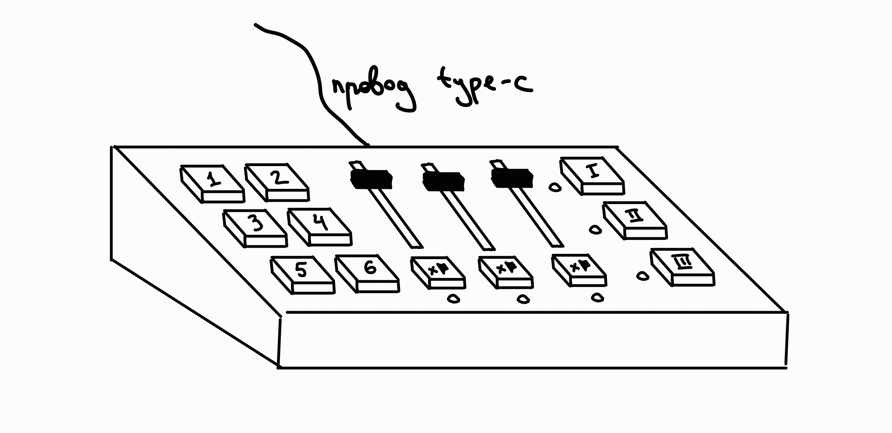

# DIY Stream Deck

Программируемая панель звукового управления с физическими кнопками и ползунками. Подключается к компьютеру по USB-C и позволяет управлять звуком без переключения между окнами программ и системными настройками.

## Цель проекта

Создать панель на базе микроконтроллера для быстрого запуска звуковых эффектов и управления аудио на компьютере с настройкой функций кнопок и ползунков через программное обеспечение.

## Текущий прогресс

- Проверены размеры вырезов под кнопки и ползунки.
- Собран первый прототип на макетной плате с **1 кнопкой и 1 ползунком**.
- С помощью прототипа уже можно **управлять общей громкостью на компьютере**.
- При нажатии кнопки воспроизводится переданный программе MP3-файл.
- Смоделирована тестовая модель устройства

## Запуск программы

```powershell
py -m pip install pyserial pycaw
py src/volume.py
```

Программа воспроизводит файл `meow-1.mp3` из корня проекта.

Если последовательный порт не удалось определить автоматически, укажите его явно:

```powershell
py src/volume.py --port COM3
```

## Планируемые возможности

- Независимая регулировка громкости программ и источников звука: браузера, проигрывателя, игры, голосового чата и других.
- Три пользовательских слоя с разными привязками программ и аудиоканалов к ползункам.
- Запуск сохранённых звуковых файлов, включение и отключение аудиоканалов, переключение слоёв и выполнение назначенных команд.
- Управление обработкой микрофона в реальном времени, включая эффекты для голоса и параметры обработки.
- Переназначение функций кнопок и ползунков через ПО.
- Подключение и питание по USB-C.

Планируемая конфигурация: **6 программируемых кнопок, 3 ползунка и 3 пользовательских слоя**.

## Эскиз



## Элементная база

- Микроконтроллер.
- 12 механических кнопок: свичи и кейкапы, напечатанные на 3D-принтере.
- 3 ползунка-потенциометра.
- Разъём и кабель USB Type-C.
- 3 светодиода для индикации состояния кнопок.
- Корпус, напечатанный на 3D-принтере.
- Вплавляемые гайки, винты и антискользящие наклейки для ножек.

## Задачи проекта

- Анализ аналогов и выбор доступных компонентов.
- Создание прототипа панели с программируемыми кнопками.
- Разработка ПО для управления устройством и настройка взаимодействия с компьютером.
- Разработка печатной платы.
- Сборка, тестирование и отладка устройства.

## Аналоги

Краткое сравнение из проектного предложения:

| Устройство | Преимущества | Ограничения |
| --- | --- | --- |
| Elgato Stream Deck | Гибкая настройка, дисплеи на клавишах, поддержка множества программ и удобное ПО | Высокая стоимость, закрытая платформа, ограниченная модификация, отсутствие ползунков |
| Loupedeck Live | Программируемые кнопки и вращающиеся регуляторы, удобное управление звуком | Высокая стоимость и сравнительно большие габариты |
| [DIY MisteRdeck](https://www.printables.com/model/134529-misterdeck) | Свободный выбор расположения кнопок, возможность изменения аппаратной и программной части | Необходимость разработки ПО, отсутствие универсального ПО для настройки, сложная первоначальная настройка |

## Дальнейшее развитие

В перспективе планируется автоматическое перемещение ползунков с помощью шаговых двигателей или других приводов. Например, при отключении звука канала соответствующий ползунок сможет перемещаться в нижнее положение.
